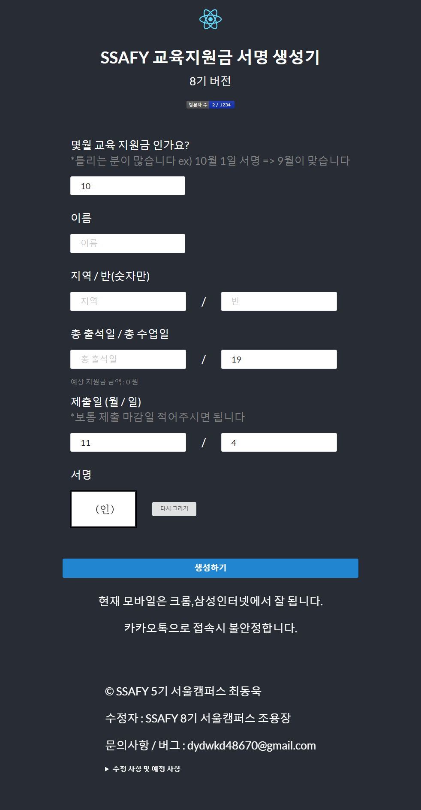
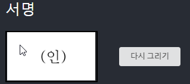
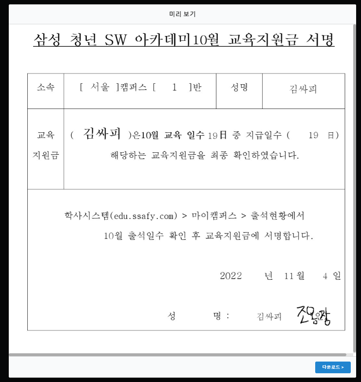

# SSAFY-서명 생성기

# 프로젝트 설명
- 삼성 청년 SW 아카데미 8기를 위한 지원금 출석 서명 생성 웹사이트
- 삼성 청년 SW 아카데미에서 월 마다 출석 여부에 따라 지원금을 지급합니다. 
- 이때 직접 작성하기 위해서는 워드에서 직접 글을 작성하고 서명을 작성하는데 불편함이 있습니다.
- 이를 해결하기 위해 웹상에서 글, 서명을 하고 이미지로 뽑아 주는 지원금 출석 서명 생성 사이트입니다.

# 프로젝트 설치 및 실행방법
### 프로젝트 접속
- https://dydwkd486.github.io/ssafy-sign/ 접속하며 사용하기
### 프로젝트 설치 및 실행
- 프로젝트를 클론한 뒤 npm start을 실행함.
- 실행과 동시에 node에서 필요한 것들이 자동으로 설치 되고 실행됨.
### 빌드하기
- npm run deploy

# 프로젝트 사용방법
### 프로그램 실행 화면

- 프로젝트 실행하면 위와 같은 화면이 나옴
- 매달 현재 달에 변경이 됩니다.
- 이름과 지역, 반, 출석일수, 수업일수, 제출일을 입력합니다.

- 이후 서명을 마우스로 클릭하여 작성할 수 있습니다.

- 마지막으로 생성하기를 눌러 생성합니다.

# 참고사항
- SSAFY 5기 서울캠퍼스 최동욱님께서 처음 만드셨습니다.
- 이후 SSAFY 8기 서울캠퍼스 조용장님이 추가적으로 8기에 맞춰 수정하였습니다.

# 수정사항
- 2022.10.31 업데이트 - 모바일에서 서명 작성 가능하게 변경, 방문자수 추가
- 2022.09.23 업데이트 - 예상 지원금 금액 볼 수 있게 추가